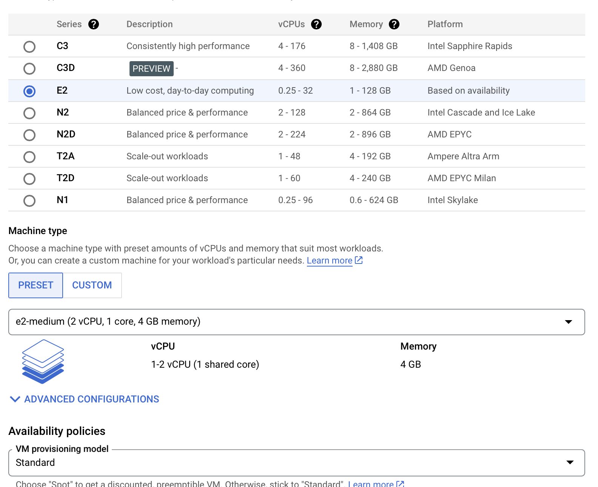
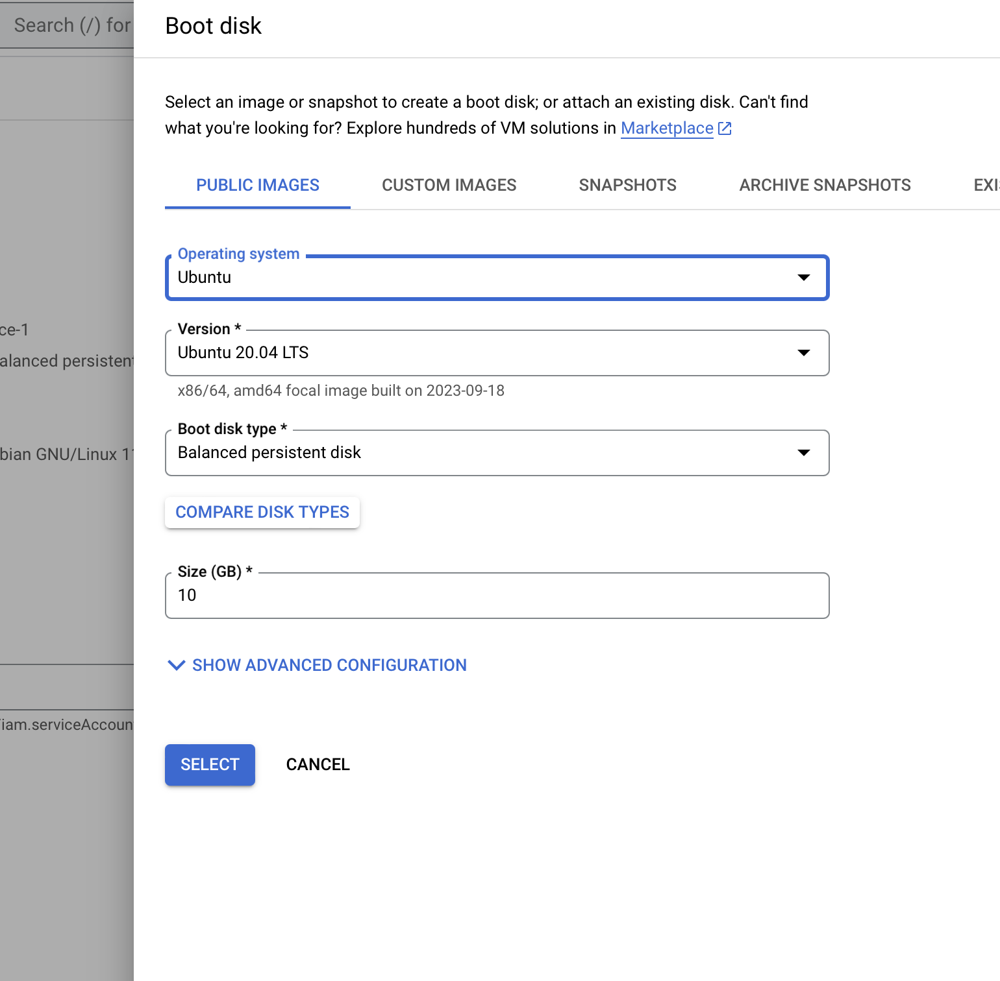
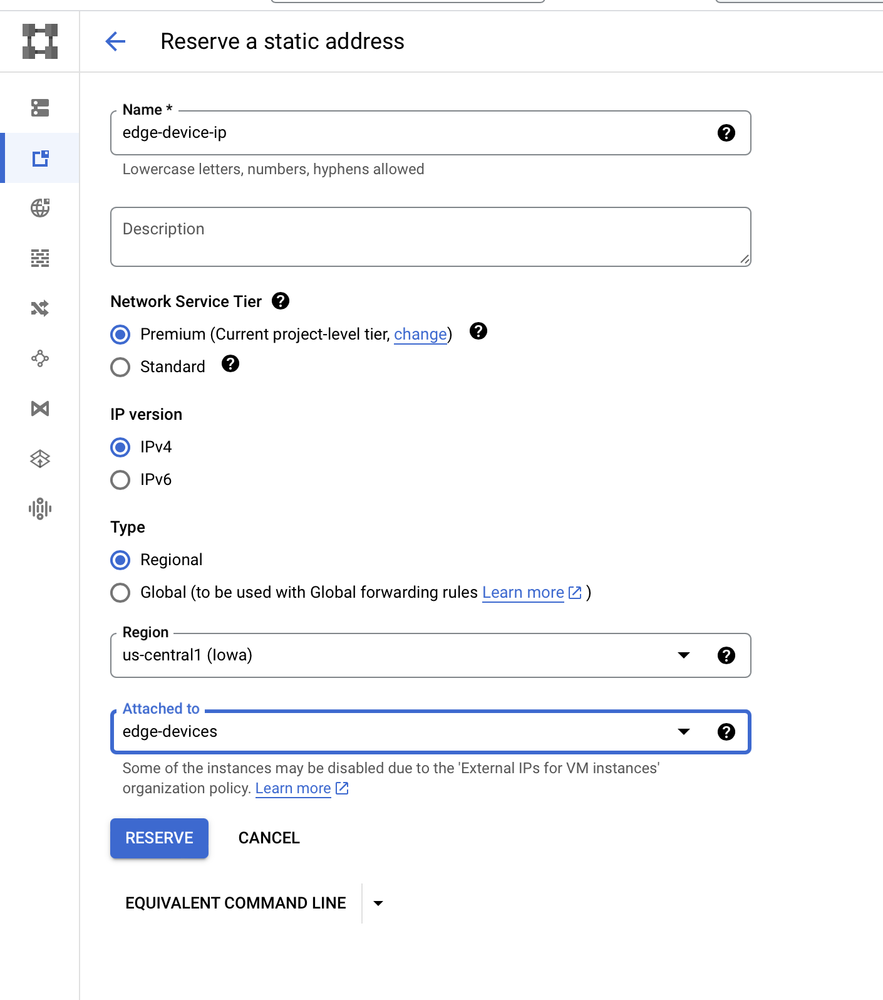
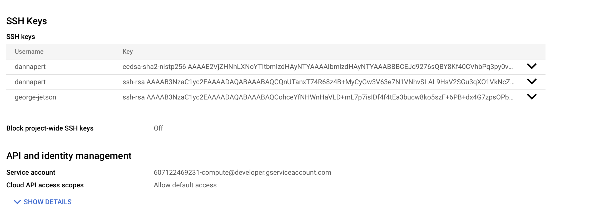

# Setting up the VM for the Jetson Nano

## Table of Contents
- [Setting up the VM for the Jetson Nano](#setting-up-the-vm-for-the-jetson-nano)
  - [Table of Contents](#table-of-contents)
- [Create SSH keypair](#create-ssh-keypair)
- [Setting up a Reverse SSH Tunnel](#setting-up-a-reverse-ssh-tunnel)
- [Finding running SSH tunnels](#finding-running-ssh-tunnels)
- [Create a Service that runs the tunnel on startup with Systemd](#create-a-service-that-runs-the-tunnel-on-startup-with-systemd)
- [Starting multiple tunnels with the same service](#starting-multiple-tunnels-with-the-same-service)
- [Setting up Mosquitto MQTT Broker](#setting-up-mosquitto-mqtt-broker)
- [Accessing a VNC Server Behind NAT via a Cloud VM Bridge](#accessing-a-vnc-server-behind-nat-via-a-cloud-vm-bridge)
  - [1. Set Up a Reverse SSH Tunnel from VNC Server to VM](#1-set-up-a-reverse-ssh-tunnel-from-vnc-server-to-vm)
  - [2. Set Up an SSH Tunnel from Local Machine to VM](#2-set-up-an-ssh-tunnel-from-local-machine-to-vm)
  - [3. Connect with VNC Client](#3-connect-with-vnc-client)
  - [4. Automate and Persist the Connection](#4-automate-and-persist-the-connection)

I chose an Ubuntu instance, due to it's popularity and ease of use, but this should work on any Linux server.

We are going to create a machine that is capable of maintaing an SSH connection, powerful enough to act as a bridge for a VNC server on the nano, and the video stream from the Nano to the client.

First we navigate to the Google cloud console and create a new VM instance. I chose the default e2 instance with 2 vCPUs and 4GB of memory. 



I selected Ubuntu 20.04 LTS image with 10gb storage.



Once the instance is created, we need to assign a static ip address

Navigate to VPC network > External IP addresses
And select reserve static address

Assign the static ip to the instance we just created



SSH should be allowed by default on the machine, so no new firewall rules are needed.

# Create SSH keypair
   
Now, in order to be able to connect the nano to the VM over ssh, we need a keypair. On the Nano, run:

```
ssh-keygen -t rsa -f ~/.ssh/<keyname> -C <new username> -b 2048
```

This will create a new keypair in the ~/.ssh directory. The public key will be named \<keyname>.pub and the private key will be \<keyname>

Set proper permissions on the private key:

```
chmod 400 ~/.ssh/<keyname>
```

we need to copy the pulic key to the VM. 
On your local machine, run:

```
cat ~/.ssh/<keyname>.pub
```
copy the output of this command to your clipboard.

In the cloud console, navigate to Compute Engine > VM Instances and click on the instance we just created.
Click edit at the top, and scroll down to SSH keys. Click add item and paste the public key into the box. Click save at the bottom.



Sometimes, it is necessary to restart the VM for the changes to take effect.

Now we can ssh into the VM from our local machine:

```
ssh -i ~/.ssh/<keyname> <username>@<public ip>
```

Refer to the [Jetson Nano Setup](Jetson_nanO_20.04_setup.md) for instructions on how to set up the Nano to connect to the VM.


# Setting up a Reverse SSH Tunnel

To allow remote access to the Jetson Nano, we will set up a reverse ssh tunnel. This will allow us to connect to the Jetson Nano from anywhere in the world through our VM.


 On the Nano, install autossh. autossh will automatically restart the ssh connection if it is interrupted.
```
sudo apt install autossh
```

 Now we can use autossh to set up the reverse tunnel
to start normally, run:
```
autossh -N -R 10022:localhost:22 -i <path/to/private/key> <server user>@<server public ip>
``````
 To start in a tmux session:
``` 
tmux new-session -s -d ssh "autossh -N -R 10022:localhost:22 -i <path/to/private/key> <server user>@<server public ip>"
```
   * -N tells autossh not to run any commands on the server
   * -R tells autossh to set up a reverse tunnel
   * 10022 is the port on the server that will be forwarded to port 22 on the Nano
   * localhost is the address on the server that will be forwarded to the Nano
   * 22 is the port on the Nano that will be forwarded to the server
   * -i tells autossh to use the key file
   
   
 Now that the tunnel is set up, we can ssh into the Nano from the server
```
ssh -p 10022 jetson@localhost
```
   * -p tells ssh to use port 10022
   * jetson is the username on the Nano
   * localhost is the address on the server that is forwarded to the Nano

And thats it! Now you can ssh into the Nano from anywhere in the world, as long as it has an internet connection. The ssh command will need to be run from the server on every session.

To kill the autossh process, run:
```
pkill autossh
``````
# Finding running SSH tunnels
  Sometimes, you may encounter an error when trying to start a new tunnel, saying that the port is already in use or port forwardng failed on the specified port. This (usually) means that there is already an ssh tunnel running on that port. To find the process that is using the port, run:
```
sudo lsof -i -n | egrep '\<ssh\>'
```
or alternatively

```
sudo netstat -tulpn | grep ssh
```
You may have to run this on the Nano and the server, depending on which one you are trying to start the tunnel on.

You will be given a list of processes that are using ssh with their corresponding ID's and IP addresses. Find the one that is using the port you want to use, and kill it with:
```
sudo kill <process id>
```
# Create a Service that runs the tunnel on startup with Systemd

To start `autossh` (or any command, for that matter) on system startup, you'll typically use system service managers. For modern Linux systems, this often means using `systemd`.

Below is a step-by-step guide on creating a `systemd` service for `autossh`:

1. **Create a systemd Service File**:

    Open a new service file for editing:

    ```bash
    sudo nano /etc/systemd/system/autossh-tunnel.service
    ```

2. **Add the Service Configuration**:

    In the editor, input the following:

    ```ini
    [Unit]
    Description=AutoSSH tunnel service
    After=network.target

    [Service]
    User=your_username
    Environment="AUTOSSH_GATETIME=0"
    ExecStart=/usr/bin/autossh -M 0 -N -q -L -i <path/to/keyfile> 10022:localhost:22 cloud_user@cloud_VM_IP

    [Install]
    WantedBy=multi-user.target
    ```

    - `Description` provides a brief description of the service.
    - `After` ensures the service starts after the network is up.
    - `User` specifies which user will run the command.
    - `Environment` sets an environment variable to ensure that `autossh` starts even if the connection hasn't been established before.
    - `ExecStart` is the command that `systemd` will run to start the service.
    - The `[Install]` section provides instructions for when the service is enabled to start on boot.
    The ssh command flags are the same as before, except we are using the full path to the keyfile.
  # Starting multiple tunnels with the same service
  If you want to start multiple tunnels with the same service, you can add multiple ExecStart lines to the service file. For example, if you want to start a tunnel to the Nano and a tunnel to a VNC server, you can add the following lines to the service file:
  ```
  ExecStart=/usr/bin/autossh -M 0 -N -q -L -i <path/to/keyfile> 10022:localhost:22 cloud_user@cloud_VM_IP -L 15900:localhost:5900 cloud_user@cloud_VM_IP
  ```

  Just a note on the flags used with `autossh`:

 **-M 0**: 
   - The `-M` option is used to specify a monitoring port.
   - When using `autossh`, the program usually monitors an SSH session by creating a loop of SSH tunnels (one for data and one for monitoring the connection). The `-M` option specifies the base monitoring port.
   - Setting `-M 0` disables this feature, meaning `autossh` will only rely on the SSH's built-in server keepalives (i.e., the `ServerAliveInterval` and `ServerAliveCountMax` options in the SSH configuration). This can simplify the setup and is often sufficient for keeping the tunnel alive.

 **-f**: 
   - This flag causes SSH to go to the background just before command execution. It's useful if you don't want the SSH session to occupy the terminal after the command is issued.

 **-N**: 
   - This flag tells SSH that you don't want to execute any remote commands, i.e., you're only setting up the tunnel, and no shell or command execution is needed on the remote end.

 **-q**: 
   - This flag tells SSH to be quiet, i.e., to suppress any non-error messages. It's useful for reducing unnecessary output, especially when you're running `autossh` in the background.

 **-L 10022:localhost:22**: 
   - This is standard SSH port-forwarding syntax and isn't specific to `autossh`.
   - `-L` denotes local port forwarding. 
   - `10022:localhost:22` means "forward my local port 10022 to port 22 on the localhost at the other end of the SSH tunnel." 

1. **Adjust Permissions**:

    After saving the file and exiting the editor, adjust the permissions to ensure systemd can read it:

    ```bash
    sudo chmod 644 /etc/systemd/system/autossh-tunnel.service
    ```

2. **Reload Systemd and Enable the Service**:

    Now, you need to reload the systemd manager configuration and enable the service to start on boot:

    ```bash
    sudo systemctl daemon-reload
    sudo systemctl enable autossh-tunnel.service
    ```

3. **Start the Service**:

    To start the service immediately (without rebooting), use:

    ```bash
    sudo systemctl start autossh-tunnel.service
    ```

4. **Checking the Service Status**:

    To verify that the service is running and see its output:

    ```bash
    sudo systemctl status autossh-tunnel.service
    ```

With this setup, the `autossh` tunnel will automatically establish itself every time the system starts up. If the tunnel drops for any reason, `systemd` and `autossh` will work together to re-establish the connection.
# Setting up Mosquitto MQTT Broker
Next, we're going to install mosquitto on the VM. Mosquitto is an MQTT broker that will allow us to send messages between the Nano and the client. This is for any sensor data we want to send to the client, and in the future, possibly ,for sending commands from the client to the Nano.

ssh into the VM and run:

```
sudo apt-add-repository ppa:mosquitto-dev/mosquitto-ppa
sudo apt-get update
sudo apt-get install mosquitto
sudo apt-get install mosquitto-clients
```
Mosquitto should now be installed. We need to create a config file to allow outside connections and to set password authentication. 

```
cd /etc/mosquitto/conf.d
sudo nano mosquitto.conf
```

Paste the following into the file:

```
allow_anonymous false
password_file /etc/mosquitto/passwd
listener 1883
listener 8080
protocol websockets
```
```

Save and exit the file.

Next, we need to create a password file. Run:

```
```
sudo nano /etc/mosquitto/passwd.txt
```

Add a username and password to the file in this format, one per line. You can add multiple users and passwords, and multiple clients can use the same credentials. This will be used to authenticate the connection between the Nano and the VM. It will need to be included in any client that connects to the broker.


```
username:password
```

Save and exit the file.

Now we need to encrypt the password file. Run:

```
mosquitto_passwd -U passwd.txt
```
if you open the file again, you will see that the password is now encrypted.

Mosquitto is already configured as a systemd service, so to start it simply run

```
sudo service mosquitto start
```

To check the status of the service, run

```
sudo service mosquitto status
```
to stop the service, run

```
sudo service mosquitto stop
```

Once started, it will run on startup and run in the background.


# Accessing a VNC Server Behind NAT via a Cloud VM Bridge

If your VNC server is behind NAT, you can access it through a cloud-based VM that acts as a bridge. This document provides instructions on setting up this bridge connection using SSH tunnels.


## 1. Set Up a Reverse SSH Tunnel from VNC Server to VM

On the VNC server machine, establish a reverse SSH tunnel to the cloud VM:

```bash
ssh -R 15900:localhost:5900 cloud_user@cloud_VM_IP
```

This maps port `5900` (VNC default port) on the remote machine to port `15900` on the cloud VM.

## 2. Set Up an SSH Tunnel from Local Machine to VM

On your local machine, establish an SSH tunnel to the cloud VM:

```bash
ssh -L 5900:localhost:15900 cloud_user@cloud_VM_IP
```

This maps port `5900` on your local machine to port `15900` on the cloud VM.

## 3. Connect with VNC Client

On your local machine, use a VNC client to connect to `localhost:5900`. This will tunnel through the cloud VM to access the VNC server on the remote machine.

## 4. Automate and Persist the Connection

 Refer to the [Create a Service that runs the tunnel on startup with Systemd](#create-a-service-that-runs-the-tunnel-on-startup-with-systemd) section for instructions on how to set up a systemd service to automatically start the tunnel on startup.


**Important**: Always remember to safeguard your private keys and never expose them to untrusted parties. This setup allows you to securely access your VNC server from any location, bypassing the NAT restrictions.